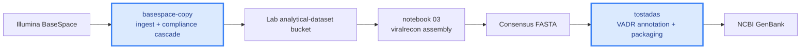

+++
title = 'Pipelines'
weight = 9
date = 2026-08-21
bookCollapseSection = true
+++

# Pipelines

APGAP ships analytical pipelines that lab users can launch either from a Jupyter notebook in their Vertex AI Workbench or from the Seqera Platform Launchpad on their project's workspace. Each pipeline is documented in its own section below with an overview, parameter reference, troubleshooting notes, and step-by-step tutorials.

Pipelines are versioned separately from this documentation. The overview page for each pipeline names the current version and links to the source repository.

## Typical journey

A common end-to-end flow through the pipelines section: pull raw sequencing data into APGAP, assemble it into consensus genomes, then package the consensus for a public submission.

You don't have to walk every step in one session. Each pipeline works on data already sitting in the lab bucket, so you can, for example, run tostadas on a consensus produced by an external assembler rather than notebook 03 if that fits your workflow better.
